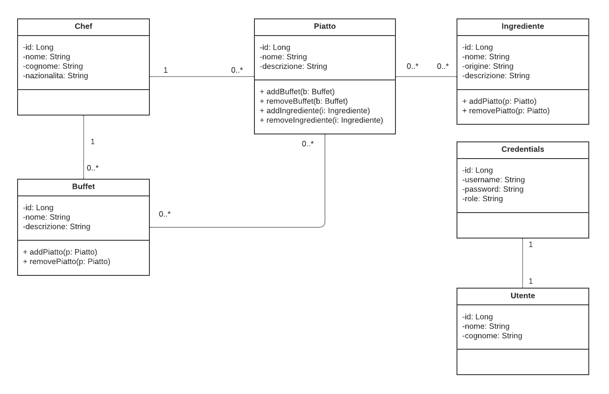

# Esame SIW Catering
Esame Sistemi Informativi su Web (docente) 2022 - Davide Bucci 547920
## Progettazione
### Diagramma delle Classi

Ho deciso di effettuare una piccola modifica al progetto: Piuttosto che considerare il solo collegamento Buffet-Piatto dove "Ogni buffet è proposto da uno chef e contiene uno o più piatti", ho deciso di creare una relazione Chef-Piatto dove "Ogni chef può proporre uno o più piatti". Dal momento che nella realtà, il Piatto è pensato da uno Chef, e che quest'ultimo possa proporre lo stesso Piatto in Buffet diversi, ho pensato che potesse essere ragionevole mantenere la relazione Buffet-Piatto aggiungendo anche la relazione Chef-Piatto, in modo tale che se più Buffet avessero dovuto avere lo stesso Piatto (ES: Spaghetti alle vongole), non sarebbe stato necessario dover aggiungere lo stesso Piatto all'interno del Sistema due volte, dal momento che il Piatto ora è in relazione con lo Chef ed ogni suo piatto è proponibile in più Buffet.

### Casi d'uso

xxx

